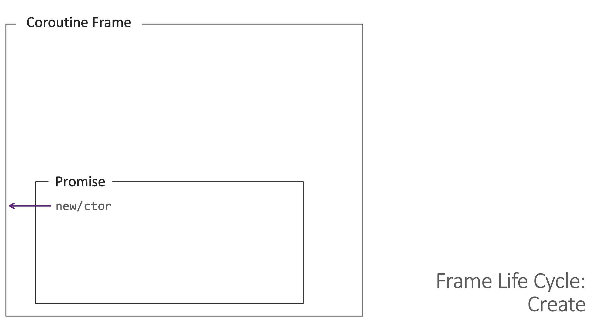
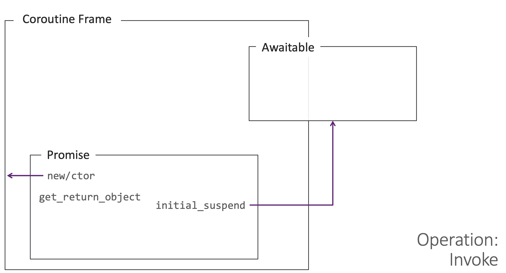
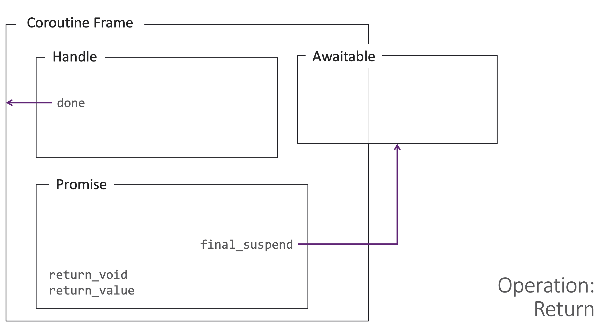
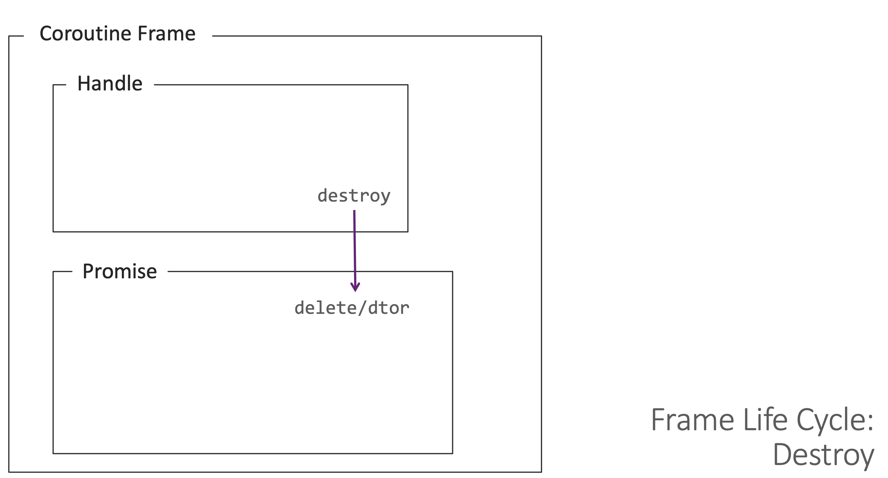
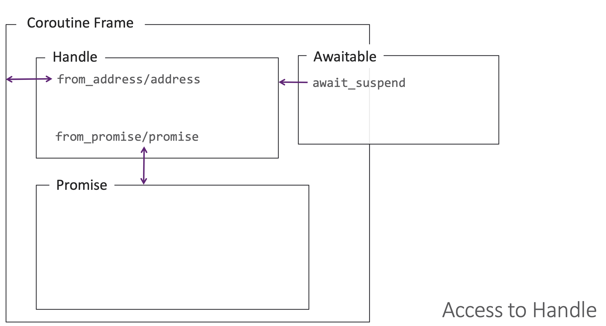
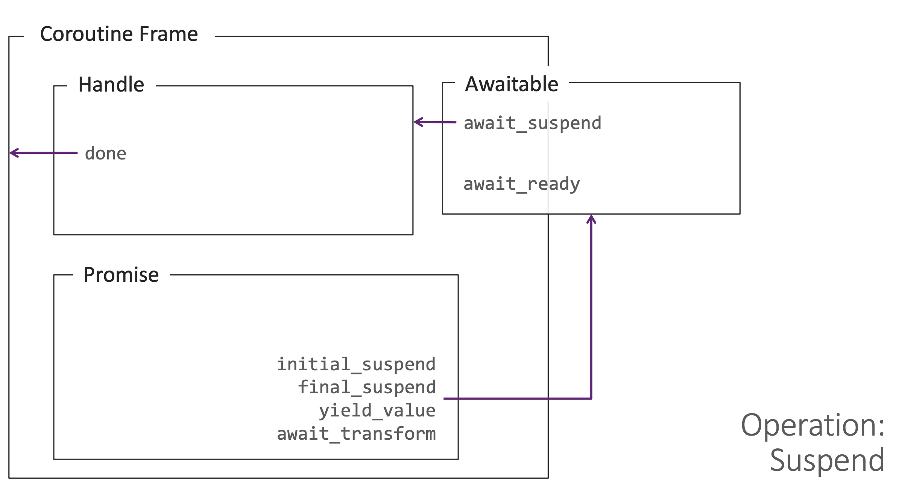
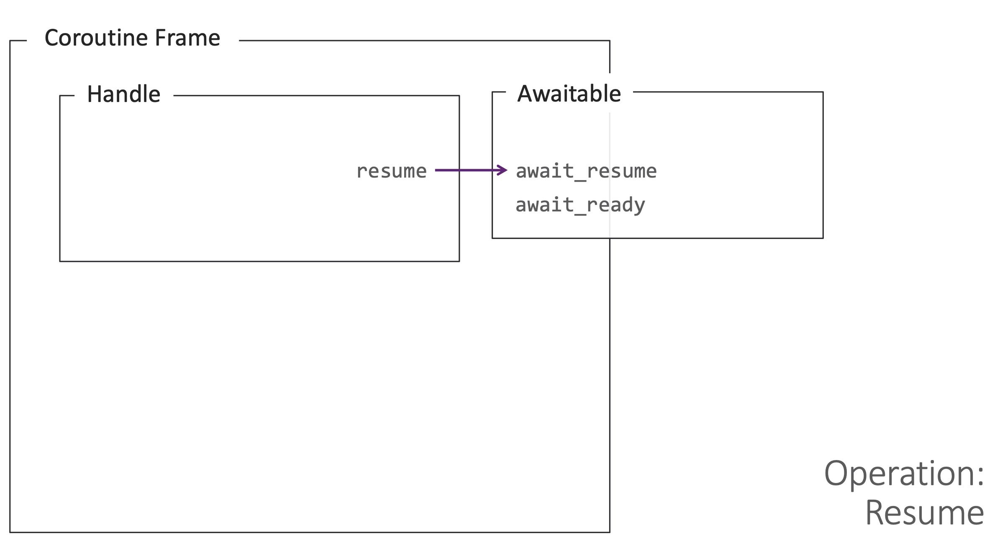
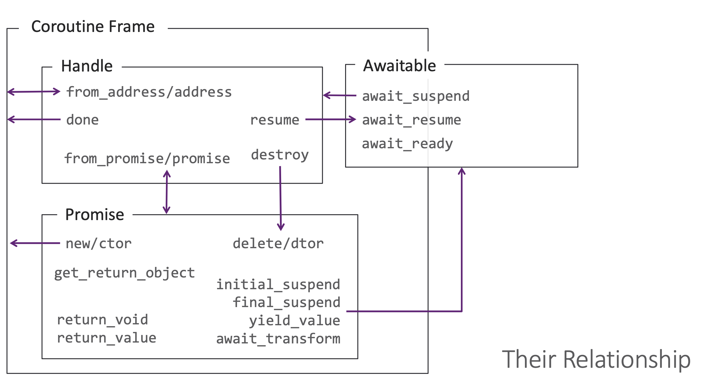

# C++ Coroutines Example

This repository demonstrates basic usage of **C++20 coroutines**.  
Coroutines allow functions to pause (`suspend`) and resume execution later, making asynchronous and incremental programming easier.

**Coroutines are commonly used for:**
- asynchronous programming
- generators
- event-driven systems
- non-blocking IO

---

## What Are Coroutines?


**A routine that supports 4 operations:** 
- Invoke
- Finalize 
- Suspend 
- Resume

### C++ Extension

| Concept   | C++ Coroutine Syntax / API | Example Code |
|-----------|---------------------------|--------------|
| Invoke    | Normal function call      |
| Suspend   | `co_await`, `co_yield`    |
| Resume    | `coro.resume()`           |
| Finalize  | `co_return`               |


A **coroutine** is a function that can suspend execution and continue later from the same point.


C++20 introduces three main coroutine keywords:

- `co_await` – suspend until an asynchronous operation completes
- `co_yield` – produce a value and suspend
- `co_return` – return from a coroutine

## What are in the Coroutine Frame
### Coroutine Frame
    - Function Parameters (save all parametr in frame)
    - local variables (save local variables on heap)
    - The Promise Object (object peromis_type on frame)
    - Suspend Point / State Machine Index
    - Temporaries
    - Register Spills

## permition Type
**permition_type:** object for contact coroutine and runtime
compiler make permition_type:
    - manage state coroutine
    - manage exception
    - suspend behavior
### struct Permition Type
```cpp
struct promise_type {

    auto get_return_object();

    std::suspend_never initial_suspend();

    std::suspend_never final_suspend() noexcept;

    void return_void();

    void unhandled_exception();
};

```
1-`get_return_object` create object return coroutine
2- `initial_suspend` - > `std::suspend_never` or `std::suspend_always`
3- `final_suspend()`
4- `void return_void()` for coroutine void
5- `return_value(int v)` for return value
6- `unhandled_exception()` handel exeption`

**main task permition type**
- help compile time
- create coroutine frame
- controle memory allocate
- create return object
- get value cou_return
- manage exception


## Await
**await** : object `pause,resume` coroutine
**await heart coroutine**


**Operator co_awaitrequires multiple function**
- `await_ready()` - `true`   not suspend  `false` coroutine stop
- `await_suspend()`  - ‍‍‍`void await_suspend(std::coroutine_handle<> h);`
- `await_resume()` - `T await_resume();`


**By using co_await…**
- Compiler can generates suspend point at the line.
- Programmer can manage coroutine’s control flow with the suspension

---
## coroutine State Machine
**compiler make coroutine Freme**
- `local varible`: all variable define in coroutine
- `input parametr`
- `Program Counter`
- `Promise object`
- `**Operations**`
    - `Suspension`: co_yield or co_await
    - `Resumption`:handle.resume
    - `Destruction`:handle.destroy
    - `Completion`:co_return

**Task Class**
In C++, the language doesn't give you a ready-made "Async Framework"; it gives you the tools to build one. Task is the class that you (or libraries like Asio) create to make coroutines usable by the programmer.
- `member Data`:```cpp std::coroutine_handle<promise_type> ```
- `memory manage`
- `Move Semantics`
- `Member Functions`
    -   is_ready
    - get
    - resume
```cpp
// Task Class (ساختار داده‌ای سازمان‌دهی شده)
struct MyTask {
    struct promise_type { ... }; // جزئیات مدیریت کوروتین
    std::coroutine_handle<promise_type> h;

    MyTask(std::coroutine_handle<promise_type> h) : h(h) {}
    ~MyTask() { if(h) h.destroy(); } // پاکسازی خودکار
    
    void next() { h.resume(); } // عملیات Resume
};

// Coroutine (توقعی که وضعیتش را حفظ می‌کند)
MyTask count_to_two() {
    std::cout << "1"; 
    co_await std::suspend_always{}; // Suspension Point 1
    std::cout << "2";
    co_await std::suspend_always{}; // Suspension Point 2
}
```
**Coroutine means "code" (stoppable logic), while the Task class means "management" (how to interact with that code and manage its memory).**

## how can we acquire the coroutine_handle<void>object
```cpp
std::coroutine_handle<promise_type>::from_promise(*this)
```
### what coroutine_handle<void>

```cpp
std::coroutine_handle<>
std::coroutine_handle<void>
```
**handel can :**
- resume()
- destroy()
- done()
- can not access promise
**how co_await**
```cpp
struct MyAwaiter {
    bool await_ready() {
        return false;
    }

    void await_suspend(std::coroutine_handle<> h) {
        // این h همان coroutine_handle<void> است
        std::cout << "Got coroutine_handle<void>\n";

        h.resume();
    }

    void await_resume() {}
};

```


## Coroutine components










## Generate Coroutine
**co_yield**: Similar to co_return, but the name implies suspension rather than return

**what Generator?**
 - normal function
```cpp
    int f() {
    return 10;
}
```
- generator
```cpp
Generator counter() {
    co_yield 1;
    co_yield 2;
    co_yield 3;
}
```
 when see Compiler `co_yield value;` convert to `co_await promise.yield_value(value);`

 ### Coroutine Keyword Comparison

| Keyword | Meaning |
| :--- | :--- |
| `co_yield` | Produces a temporary value and suspends the coroutine |
| `co_return` | Ends the coroutine |
| `return` | Not allowed in a coroutine |

**create generator**
```cpp
yield_value(value)
initial_suspend()
final_suspend()
return_void()
unhandled_exception()
get_return_object()
```

## Switching Thread (Coroutine + Message Queue)
- `coroutine`: Coroutines allow you to write code in a linear/readable way.
- `Message Queue/EventLoop`:It gives you a scheduling mechanism.
- `By combining the two`: when you write co_await ... in a coroutine, you can suspend the execution of the coroutine and, instead of continuing on the same thread, send a message to the destination thread's queue so that the same thread can later call resume(). Result: The continued execution of the coroutine is actually done on a new thread.

#### problem
**before coroutine:** To go from UI thread to worker and back, you usually have a callback or signal/slot or postEvent.

**use Coroutine:**
```cpp
co_await switch_to(worker);
do_heavy_work();
co_await switch_to(ui);
update_ui();
```
#### switch Thread in c++20
- co_await expr causes the compiler to create a suspend point.
- Then awaiter involves these functions:
            `await_ready()→await_suspend(handle)→await_resume()`
So if resume() is executed on the worker thread, the continuation of the coroutine is on the worker.

#### What is the role of Message Queue?
Message Queue is a thread-safe queue of "tasks to be executed on this thread".

Each thread usually has a loop (Event Loop):

```cpp
while (running) {
    auto job = queue.pop();   // بلوکه تا کار برسد
    job();                    // اجرا روی همین ترد
}

```
So if we send this task to the destination thread queue inside await_suspend:

“task” = a lambda that calls handle.resume()

That coroutine will be moved to the destination thread.

**Note**
- "Just having a coroutine" doesn't change the thread
co_await itself is not async/threading.
It's the awaiter and the scheduler/message queue that decide where the resume should occur.

- What if the caller destroys the coroutine early?
If you have sent the handle to the queue but the coroutine is destroyed before the queue executes it, you are facing a potential use-after-free.

Solutions are usually one of the following:

Keep the coroutine in a wrapper (Task) that manages the lifetime.
Use refcount/shared_ptr for state.
Use cancellation tokens and check "am I still alive?" before resuming.

- The UI thread is usually restricted
For example in Qt:

Only the UI thread is allowed to manipulate the UI.

So switch_to(ui) must be connected to Qt's own event loop (QMetaObject::invokeMethod / QCoreApplication::postEvent).

- backpressure and overflow
If the producer is faster than the consumer, the queue grows. You should have a policy:
bounded queue
drop/coalesce
priority

## await_transform
In the standard C++20 coroutine design, the await_transform mechanism is one of the hidden and very powerful parts of promise_type. This method allows you to intercept, modify, or convert the value after co_await.

In simple terms:

await_transform acts as a compile-time "type translator or converter".

### why?
- Problem without await_transform
```cpp
co_await expression;
```
The compiler expects the expression itself to be an Awaitable directly (i.e., it has the await_ready, await_suspend, and await_resume methods).

But if you try to co_await something that is not an awaitable (for example, a number, a raw time like std::chrono::milliseconds, or an object from another library), the compiler will throw an error.

- await_transform mechanism
If the compiler finds a method called await_transform in the promise_type class, it will filter all co_await statements within that coroutine.
```cpp
co_await expression;
```
**To**
```cpp
co_await promise.await_transform(expression);
```
With this, the output of the await_transform method should be the final object that implements the awaitable protocol.


#### Application scenarios
- Suspending a coroutine for a specified period of time (std::chrono)
Without `await_transform` you can't write co_await 100ms;. But by defining it in promise_type:

```cpp
#include <coroutine>
#include <chrono>
#include <iostream>

struct SleepAwaiter {
    std::chrono::milliseconds duration;
    
    bool await_ready() const noexcept { return false; }
    void await_suspend(std::coroutine_handle<> h) const {
        std::cout << "[Timer] Sleeping for " << duration.count() << "ms...\n";
        h.resume(); 
    }
    void await_resume() const noexcept {}
};

struct Task {
    struct promise_type {
        Task get_return_object() { return Task{}; }
        std::suspend_never initial_suspend() { return {}; }
        std::suspend_never final_suspend() noexcept { return {}; }
        void return_void() {}
        void unhandled_exception() {}

        template<typename Rep, typename Period>
        SleepAwaiter await_transform(std::chrono::duration<Rep, Period> d) {
            return SleepAwaiter{ std::chrono::duration_cast<std::chrono::milliseconds>(d) };
        }
    };
};

Task my_coroutine() {
    using namespace std::chrono_literals;
    std::cout << "Step 1\n";
    co_await 500ms; // کامپایلر تبدیل می‌کند به: co_await promise.await_transform(500ms)
    std::cout << "Step 2\n";
}

```

- Convert `std::future` to `Awaitable` at compile time
Suppose you want to execute standard old asynchronous functions with co_await:
```cpp
#include <future>

template<typename T>
struct FutureAwaiter {
    std::future<T> fut;

    bool await_ready() { 
        // چک می‌کند که آیا تردِ کارگر تمام شده است یا نه
        return fut.wait_for(std::chrono::seconds(0)) == std::future_status::ready; 
    }
    
    void await_suspend(std::coroutine_handle<> h) {
        // فرستادن هرموقع آماده شد برای رزومه روی ترد پول
        std::thread([this, h]() {
            fut.wait();
            h.resume();
        }).detach();
    }

    T await_resume() { 
        return fut.get(); // بازگرداندن مقدار نهایی
    }
};

// در promise_type کوروتینِ خود:
template<typename T>
FutureAwaiter<T> await_transform(std::future<T>&& fut) {
    return FutureAwaiter<T>{ std::move(fut) };
}
```

#### Overload Hijacking
There is a very crucial point that can be a pain for C++ developers:

Rule: If you define even one overload of await_transform in promise_type, the compiler's default behavior for the rest is disabled. That is, the compiler will try to pass anything you write in front of co_await through the await_transform input from then on.

If you want standard awaiters to still work, you need to add a generic function as a fallback, like this:
```cpp
struct promise_type {
    // ۱. مبدل اختصاصی شما
    SleepAwaiter await_transform(std::chrono::milliseconds ms);

    // ۲. پاس دادن بقیه Awaitableها به صورت مستقیم و بدون تغییر
    template<typename T>
    T&& await_transform(T&& awaitable) noexcept {
        return std::forward<T>(awaitable);
    }
};
```
## Requirements

- C++20 compatible compiler  
- GCC 10+ / Clang 12+ / MSVC with C++20 support:
