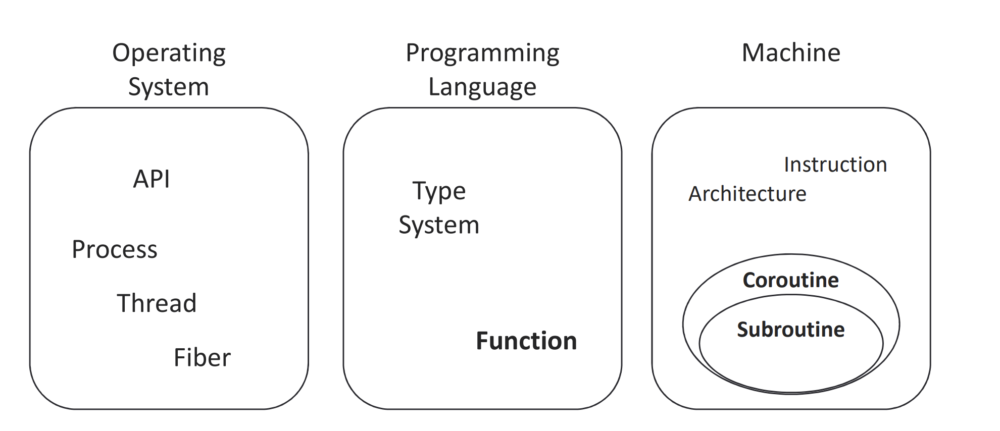
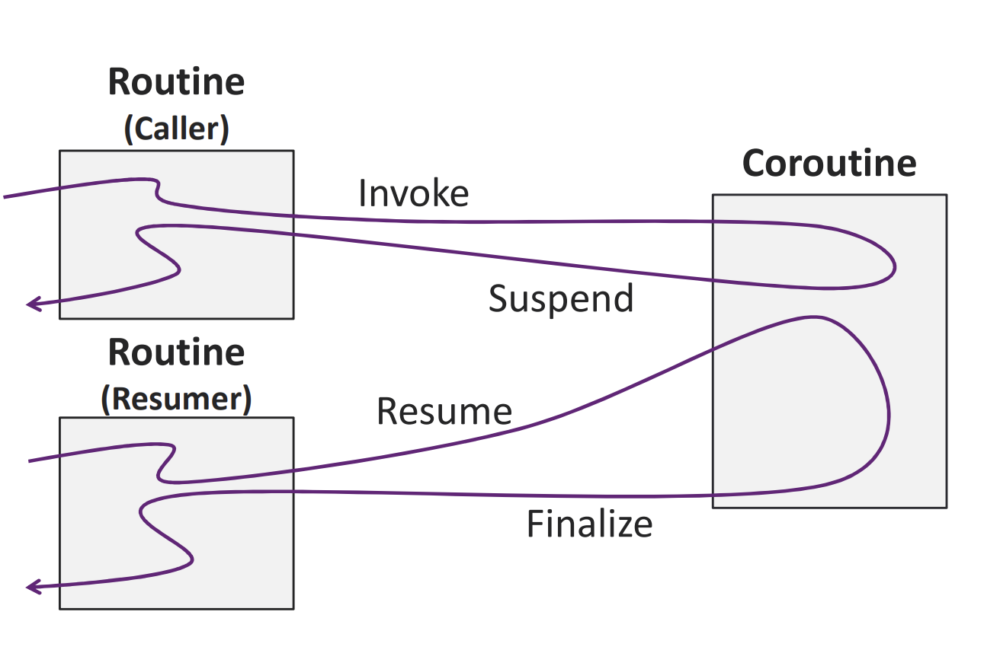

# C++ Coroutines Example

This repository demonstrates basic usage of **C++20 coroutines**.  
Coroutines allow functions to pause (`suspend`) and resume execution later, making asynchronous and incremental programming easier.

**Coroutines are commonly used for:**
- asynchronous programming
- generators
- event-driven systems
- non-blocking IO

---

## What Are Coroutines?



**A routine that supports 4 operations:** 
- Invoke
- Finalize 
- Suspend 
- Resume

### C++ Extension

| Concept   | C++ Coroutine Syntax / API | Example Code |
|-----------|---------------------------|--------------|
| Invoke    | Normal function call      |
| Suspend   | `co_await`, `co_yield`    |
| Resume    | `coro.resume()`           |
| Finalize  | `co_return`               |


A **coroutine** is a function that can suspend execution and continue later from the same point.


C++20 introduces three main coroutine keywords:

- `co_await` – suspend until an asynchronous operation completes
- `co_yield` – produce a value and suspend
- `co_return` – return from a coroutine

## What are in the Coroutine Frame
### Coroutine Frame
    - Function Parameters (save all parametr in frame)
    - local variables (save local variables on heap)
    - The Promise Object (object peromis_type on frame)
    - Suspend Point / State Machine Index
    - Temporaries
    - Register Spills

## permition Type
**permition_type:** object for contact coroutine and runtime
compiler make permition_type:
    - manage state coroutine
    - manage exception
    - suspend behavior
### struct Permition Type
```cpp
struct promise_type {

    auto get_return_object();

    std::suspend_never initial_suspend();

    std::suspend_never final_suspend() noexcept;

    void return_void();

    void unhandled_exception();
};

```
1-`get_return_object` create object return coroutine
2- `initial_suspend` - > `std::suspend_never` or `std::suspend_always`
3- `final_suspend()`
4- `void return_void()` for coroutine void
5- `return_value(int v)` for return value
6- `unhandled_exception()` handel exeption`

**main task permition type**
- help compile time
- create coroutine frame
- controle memory allocate
- create return object
- get value cou_return
- manage exception


## Await
**await** : object `pause,resume` coroutine
**await heart coroutine**


**Operator co_awaitrequires multiple function**
- `await_ready()` - `true`   not suspend  `false` coroutine stop
- `await_suspend()`  - ‍‍‍`void await_suspend(std::coroutine_handle<> h);`
- `await_resume()` - `T await_resume();`


**By using co_await…**
- Compiler can generates suspend point at the line.
- Programmer can manage coroutine’s control flow with the suspension

---
## coroutine State Machine
**compiler make coroutine Freme**
- `local varible`: all variable define in coroutine
- `input parametr`
- `Program Counter`
- `Promise object`
- `**Operations**`
    - `Suspension`: co_yield or co_await
    - `Resumption`:handle.resume
    - `Destruction`:handle.destroy
    - `Completion`:co_return

**Task Class**
In C++, the language doesn't give you a ready-made "Async Framework"; it gives you the tools to build one. Task is the class that you (or libraries like Asio) create to make coroutines usable by the programmer.
- `member Data`:```cpp std::coroutine_handle<promise_type> ```
- `memory manage`
- `Move Semantics`
- `Member Functions`
    -   is_ready
    - get
    - resume
```cpp
// Task Class (ساختار داده‌ای سازمان‌دهی شده)
struct MyTask {
    struct promise_type { ... }; // جزئیات مدیریت کوروتین
    std::coroutine_handle<promise_type> h;

    MyTask(std::coroutine_handle<promise_type> h) : h(h) {}
    ~MyTask() { if(h) h.destroy(); } // پاکسازی خودکار
    
    void next() { h.resume(); } // عملیات Resume
};

// Coroutine (توقعی که وضعیتش را حفظ می‌کند)
MyTask count_to_two() {
    std::cout << "1"; 
    co_await std::suspend_always{}; // Suspension Point 1
    std::cout << "2";
    co_await std::suspend_always{}; // Suspension Point 2
}
```
**Coroutine means "code" (stoppable logic), while the Task class means "management" (how to interact with that code and manage its memory).**

## how can we acquire the coroutine_handle<void>object
```cpp
std::coroutine_handle<promise_type>::from_promise(*this)
```
### what coroutine_handle<void>

```cpp
std::coroutine_handle<>
std::coroutine_handle<void>
```
**handel can :**
- resume()
- destroy()
- done()
- can not access promise


## Requirements

- C++20 compatible compiler  
- GCC 10+ / Clang 12+ / MSVC with C++20 support:
